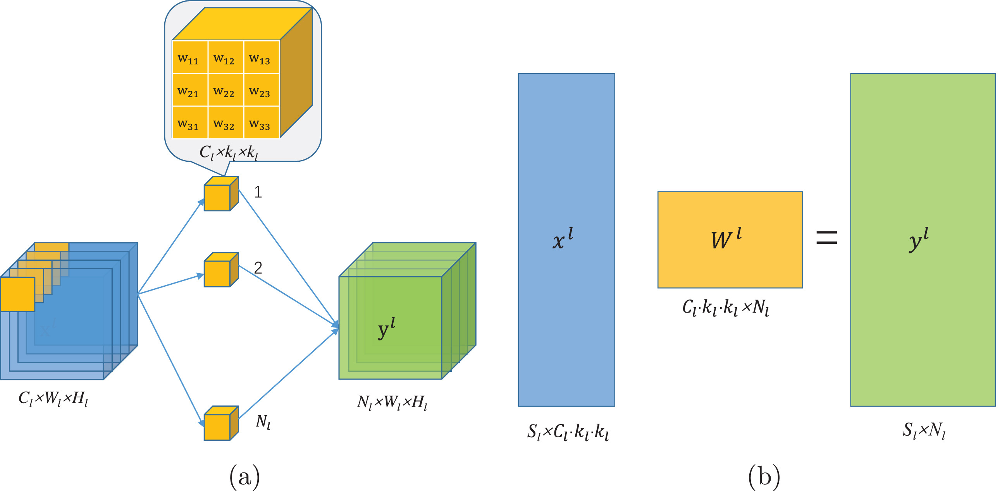

# Pruning Research of PRCI-Lab

### Differentiable neural architecture learning for efficient neural networks
*Qingbei Guo, Xiao-Jun Wu, Josef Kittler, Zhiquan Feng*, **Pattern Recognition**, 2022.  

#### [[Paper](https://www.sciencedirect.com/science/article/pii/S0031320321006245)]   [[Code](https://github.com/QingbeiGuo/DNAL)]
---

### SDA-xNet: Selective Depth Attention Networks for Adaptive Multi-scale Feature Representation
*Qingbei Guo, Xiao-Jun Wu, Zhiquan Feng, Tianyang Xu, Cong Hu*, **arXiv**, 2022.  

#### [[Paper](https://arxiv.org/abs/2209.10327)]   [[Code](https://github.com/QingbeiGuo/SDA-xNet)]
---

### Weak sub-network pruning for strong and efficient neural networks
*Qingbei Guo, Xiao-Jun Wu, Josef Kittler, Zhiquan Feng*, **Neural Networks**, 2021.  

#### [[Paper](https://www.sciencedirect.com/science/article/pii/S0893608021003658)]   [[Code](https://github.com/QingbeiGuo/WSP)]
---

### Self-grouping convolutional neural networks
*Qingbei Guo, Xiao-Jun Wu, Josef Kittler, Zhiquan Feng*, **Neural Networks**, 2020.  

#### [[Paper](https://www.sciencedirect.com/science/article/pii/S0893608020303385)]   [[Code](https://github.com/QingbeiGuo/SG-CNN)]
---

### Compression of Deep Convolutional Neural Networks Using Effective Channel Pruning
*Qingbei Guo, Xiao-Jun Wu,  Xiuyang Zhao*, **International Conference on Image and Graphics (ICIG)**, 2019.  

#### [[Paper](https://link.springer.com/chapter/10.1007/978-3-030-34120-6_62)]   [[Code](https://github.com/QingbeiGuo/Based-Taylor-Pruning)]
---
